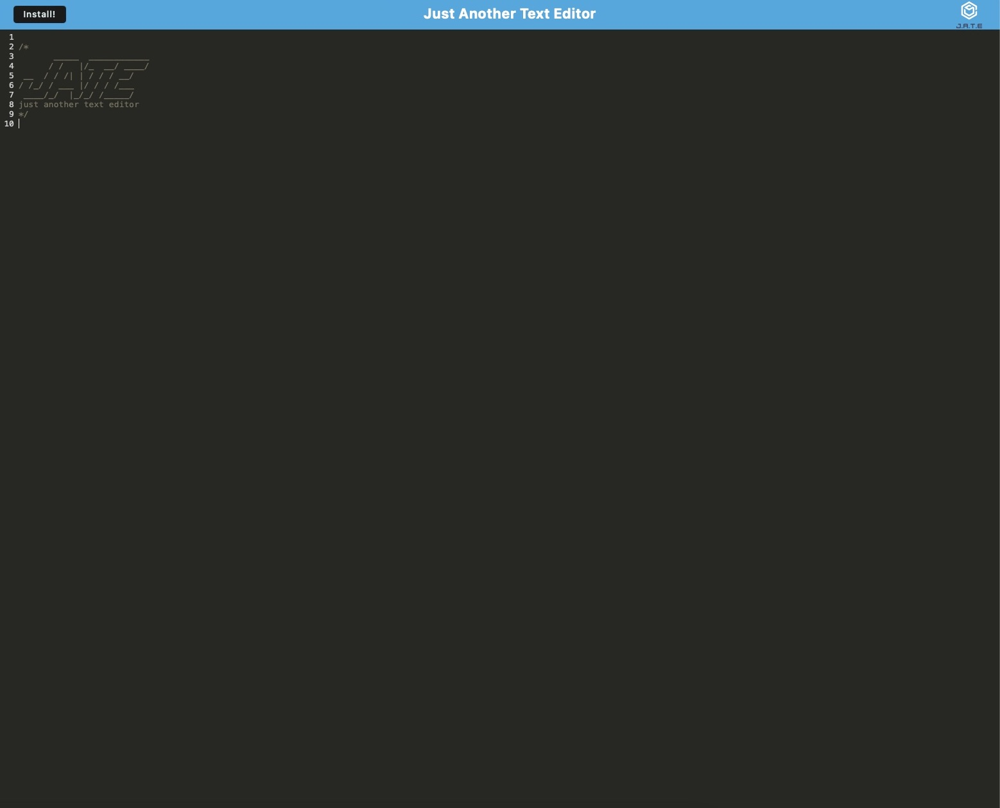

# PWA-Challenge-Text-Editor
## Table of Contents

- [Description](#description)
- [Technology](#Technology)
- [Installation](#installation)
- [Usage](#usage)
- [License](#license)
- [Questions](#questions)

## Description:

The application is a web-based text editor that lets users reliably retrieve notes or code snippets for later use even if they don't have an internet connection. The application will continue to function fully even when there is no active internet connection thanks to the integrated service worker and cache APIs. Even when the application is offline, the user can still access previously visited pages with this application.

## Installation

The user only needs to clone the repository and then issue the command "npm install" to install the project's dependencies. Since they are all part of the package, this will install all required dependencies. json.

## Usage

To use this app, just click the link for the deployed app at the top of this readme to open it in the browser. The user can access the link and click the "install" button in the top left corner of the page for offline use.
[Website!][link](https://vicspwatexteditor.herokuapp.com)

#### Screenshot

## License  
This project is covered under the No License license.

## Questions
Have questions about this project?  
GitHub: https://github.com/Vsoto7697  
Email: Vsoto7697@gmail.com